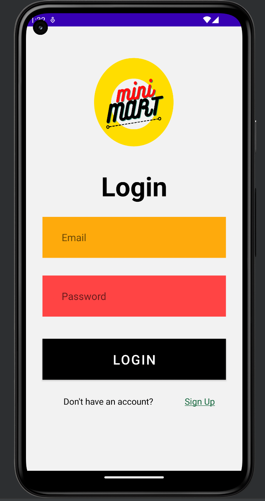
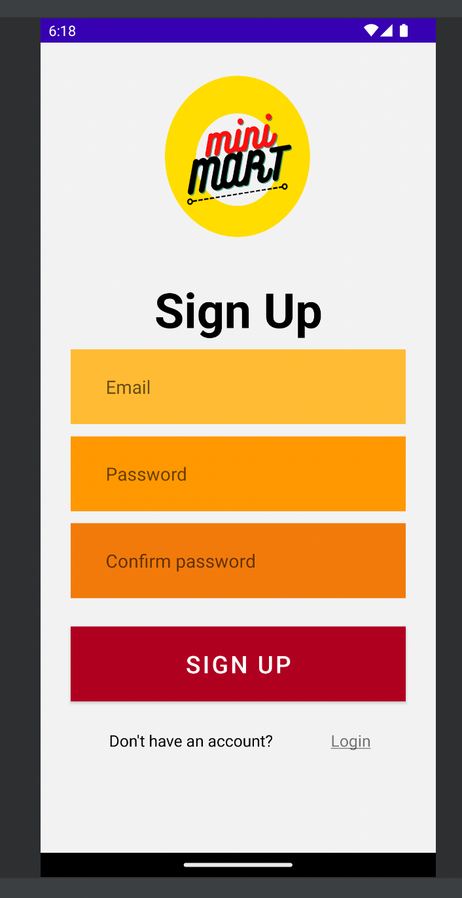
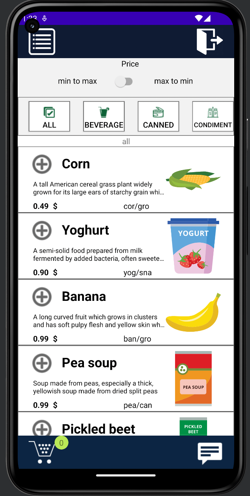
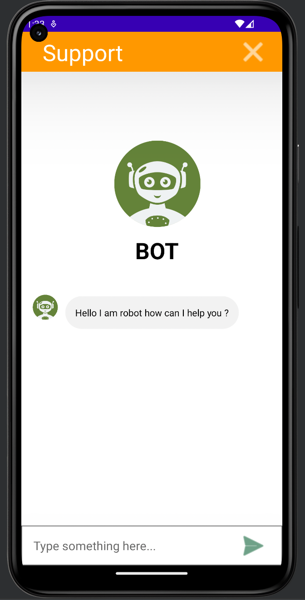
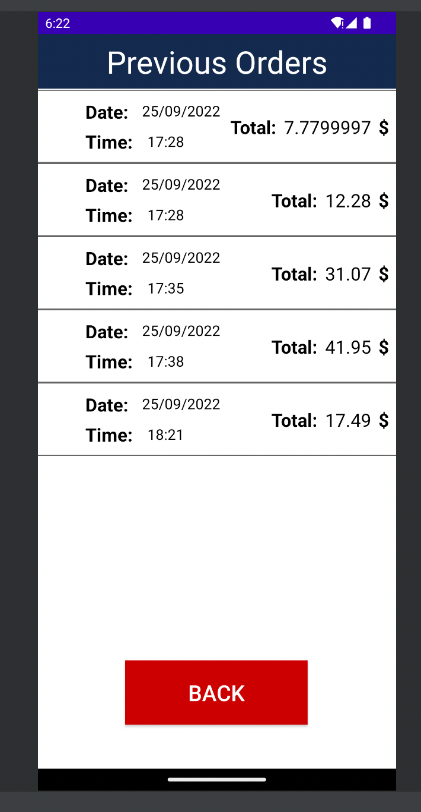
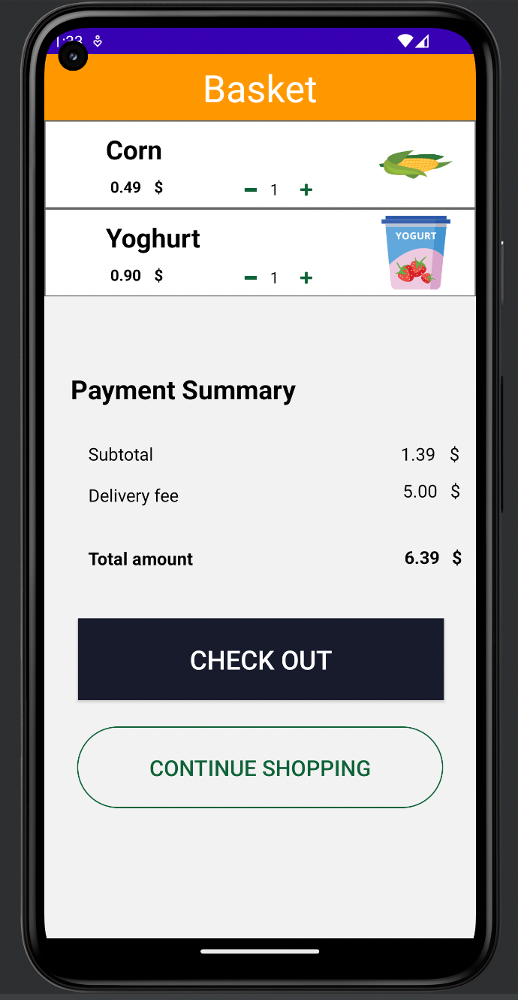
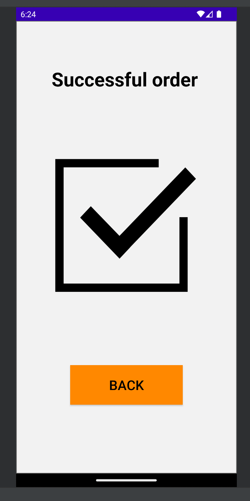

# Main Concept

The main concept of this application is to make an interactive grocery application which is assigned by SmartInternz "Learn Android Basics with kotlin". In this application an user can do login through email address and password and order grocery products from the application moreover make payments and do checkout.

# Assistance tool
In the extension part an user can get help from an interactive robot named ChatBot inside the application. If any user finds any  difficulties then user may ask help from the robot. Primarily, the robot genarates the exact same message but it is upgradable, means we can add features in this segment.Leading to a technical team is the ultimate goal of the ChatBot. A technical team support portion will be implemented when application is in Practical use.

## screens
This application contains 7 main screens. Login Screen > Main Menu > Basket > Previous Order > ChatBot > Checkout > Exit application.

### Sign In screen
Allows the user to Login by providing registered e-mail address and registered password with Forget Password option.

### Sign Up screen
Allows a new user to create a new account to the application for further usage.

### Home screen
HomeScreen is the Heart of the Application where user can visually check all the prioducts which are available with including price. From the HomeScreen User can move between other pages like ChatBot,Previous Orders and others.

### Assistance Tool
this chatbot that replies with the same text you enter

### Previous Orders screen
From this screen an user can do a quick check about his/her previous order summery.

### "Basket" screen
Products which are chosed by the user gathered in this screen.From here user edit like increasing or decreasing products quantity.

### Confirm Order screen
Once Order is confirmed a confirmation message will be toasted in users screen which i am calling as Confirm Order Screen.

